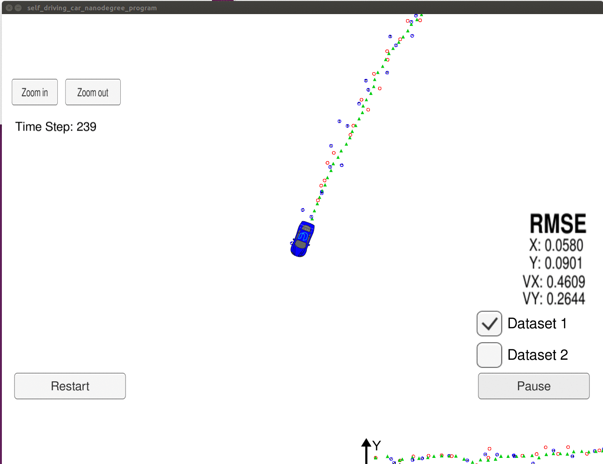
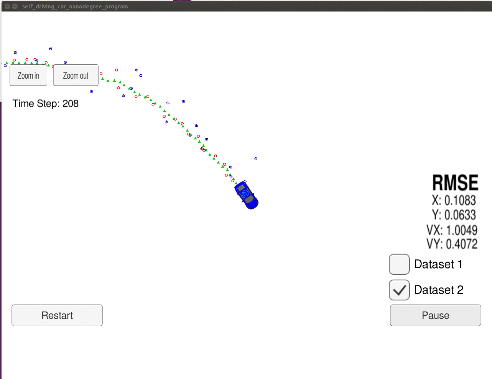

# Unscented Kalman Filter Project Starter Code
Self-Driving Car Engineer Nanodegree Program

This project utilizes an Unscented Kalman Filter to estimate the state of a moving object of interest with noisy lidar and radar measurements.

## Results

The UnscentedKalmanFilter program was run on both datasets. The results are below.
---

---

---
## Areas for improvement
* Testing

## Protocol

Here is the main protcol that main.cpp uses for uWebSocketIO in communicating with the simulator.

INPUT: values provided by the simulator to the c++ program

* ["sensor_measurement"] => the measurement that the simulator observed (either lidar or radar)

OUTPUT: values provided by the c++ program to the simulator

* ["estimate_x"] <= kalman filter estimated position x
* ["estimate_y"] <= kalman filter estimated position y
* ["rmse_x"]
* ["rmse_y"]
* ["rmse_vx"]
* ["rmse_vy"]

---

## Other Important Dependencies

* cmake >= 3.5
  * All OSes: [click here for installation instructions](https://cmake.org/install/)
* make >= 4.1 (Linux, Mac), 3.81 (Windows)
  * Linux: make is installed by default on most Linux distros
  * Mac: [install Xcode command line tools to get make](https://developer.apple.com/xcode/features/)
  * Windows: [Click here for installation instructions](http://gnuwin32.sourceforge.net/packages/make.htm)
* gcc/g++ >= 5.4
  * Linux: gcc / g++ is installed by default on most Linux distros
  * Mac: same deal as make - [install Xcode command line tools](https://developer.apple.com/xcode/features/)
  * Windows: recommend using [MinGW](http://www.mingw.org/)
* pthread library for spdlog
* 
## Basic Build Instructions

1. Clone this repo.
2. Make a build directory: `mkdir build && cd build`
3. Compile: `cmake .. && make`
   * On windows, you may need to run: `cmake .. -G "Unix Makefiles" && make`
4. Run it: `./UnscentedKF `

One change was made to CMakeLists.txt to support spdlog, a C++ logging library that eliminated the need for print statement debugging.